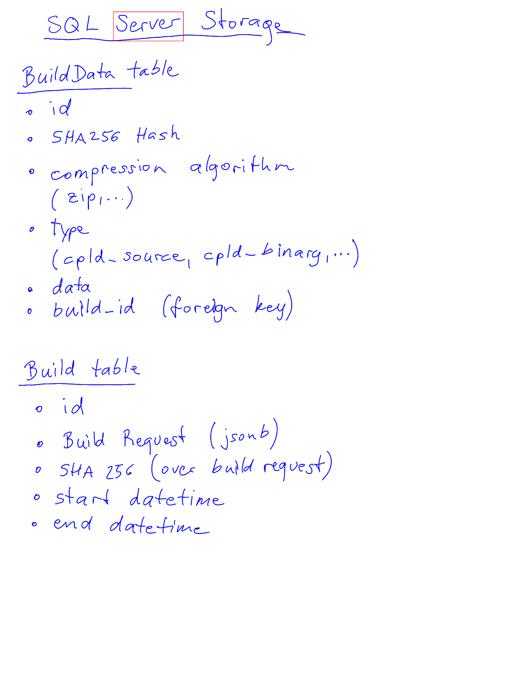

# Boox Notes Backup Parser

This is a very simple first attempt to reverse engineer the Boox Notes data format.
Tested with a Boox Note Air 2.

To test, first create a Backup in your Boox note taking app by clicking 'Option Settings' and select 'Backup and Restore'. Click the disk icon and chose a backup file name.
Connect the Boox Device to a PC and copy the backup to a PC. In my case the backup is located in 'internal shared storage/note/backup/local'. You should find a folder there with the name you have specified when you made the backup. Copy that folder to the PC and run the Python script and specify the backup directory you copied with the --directory parameter.

# Usage

Read Notebooks from backup:
```
python3 decode.py --directory ./backup
```

this gives you a list of notebooks:
```
Notebooks:
  Notepad1:                     1 pages
  Notepad2:                     6 pages
```

You can now specify a notebook and page number to read the content.

```
python3 decode.py --directory ./backup --notebook Notepad2 --page 2 --output test.png
```

This saves the notebook page as a PNG.

You can also search for a keyword on a page:

```
python3 decode.py --directory ./backup --notebook Notepad2 --page 2 --find server --output test.png
```

This searches for the keyword 'server' on page 2. The output image (in this case 'test.png') will have red rectangles around the word(s) if found:



